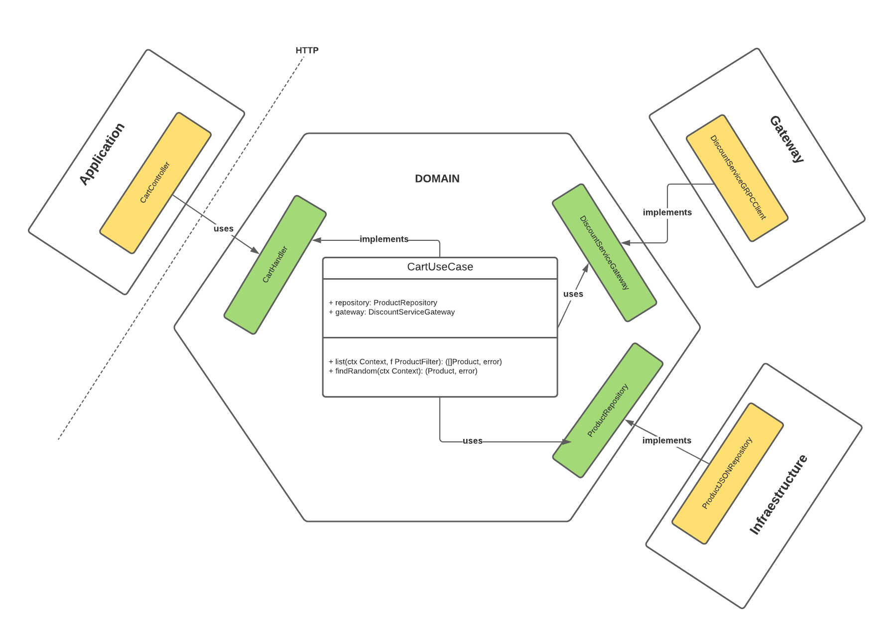

# Cart Service

This repo contains the source code of the Cart service.

## Architecture



## Requirements

| Name | Version | Notes | Mandatory
|------|---------|---------|---------|
| [golang](https://golang.org/dl/) | >= go1.15.14 | Main programming language | true
| [docker](https://www.docker.com/) | n/a | Used to handle core mock images and start local service | true
| [sh/bash] | depending on OS. Anyway, you should be able do execute any .sh file | Used to lint checks, test processes and some console interface customizations | true
| [make](https://www.gnu.org/software/make/) | depending on OS. Anyway, you should be able do execute make commands to run the project, tests and localenvironment | n/a | true

# Usage
Inside /cart, follow the steps:
### Build Images
```bash
docker compose build
```
### Start Local
```bash
docker-compose up
```

# Testing

```bash
make test                 # Run all unit tests
```
## Documentation

To access the docs locally, just change the host in the url to 127.0.0.1:9091. Something like: http://127.0.0.1:9091/cart/docs
